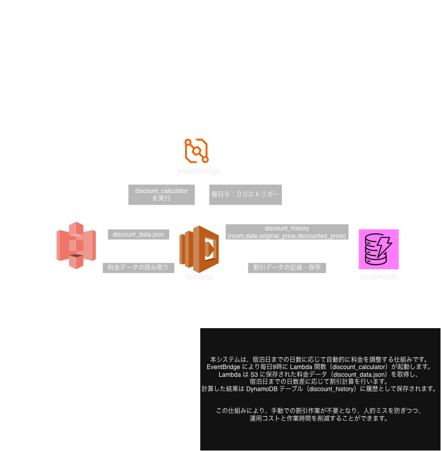

本番運用しているわけではなくポートフォリオ用プロジェクトである。
# discount-system
宿泊料金自動割引システム（AWS）

## 概要
宿泊日までの日数に応じて料金を自動で割引するシステムです。  
EventBridge により毎日9:00に Lambda 関数 `discount_calculator` が自動実行されます。  
Lambda は S3 に保存された料金データ（discount_data.json）を読み取り、  
割引計算を行い、結果を DynamoDB に履歴として保存します。

## アーキテクチャ図

## 使用技術
- AWS Lambda (Python)
- Amazon EventBridge
- Amazon S3
- Amazon DynamoDB

## 割引ロジック
- 宿泊日までの日数が 2 日以内 → 価格 × 0.9 (10%割引)
- それ以外 → 定価のまま
